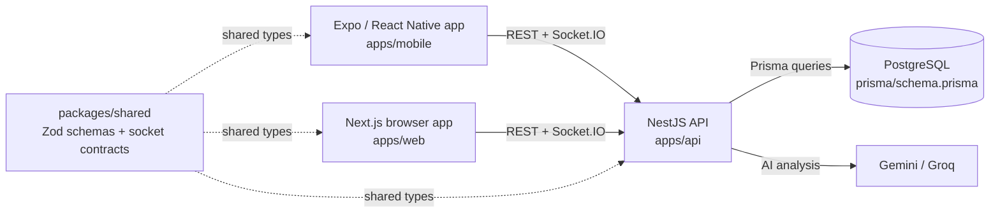
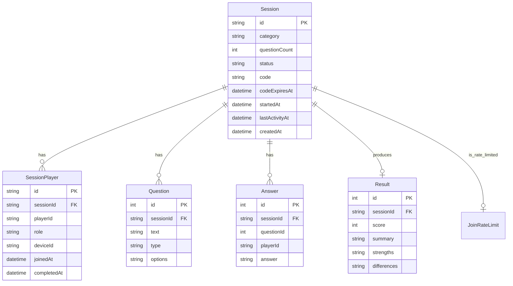

<div align="center">

# You & I

**A real-time, two-player compatibility quiz game built around a shared API contract, a Postgres-backed backend, and a React Native client.**

`TypeScript` · `Next.js` · `NestJS` · `Expo` · `Prisma` · `Postgres` · `Socket.IO`

[What it does](#what-it-does) · [Architecture](#architecture) · [Quick start](#quick-start) · [API](#api--routes) · [Docs](#documentation)

</div>

## What it does

You & I is a multiplayer compatibility quiz app where two players join a room, answer category-based questions, and receive an AI-generated compatibility result. The core experience is intentionally lightweight and shareable: a host creates a session, a second player joins by code or session link, both answer questions, and the backend produces a score summary and narrative analysis.

The repository is a monorepo with three runtime surfaces:

- `apps/api`: the authoritative backend, Prisma data layer, and Socket.IO gateway
- `apps/mobile`: the active Expo / React Native client that uses secure storage and native navigation
- `apps/web`: the browser implementation kept for share-link and legacy flows

> [!IMPORTANT]
> The server is authoritative for all persistent state. Socket events are live hints for the UI, not the source of truth.

> [!NOTE]
> The repo is in a migration period: the web app is still present, but the native app is the target product and the migration audit (`MIGRATION-AUDIT.md`) captures the browser-only risks and drift between the implementation and the documented architecture.

## Features

|   | Feature | Detail |
| -- | ------- | ------ |
| ⚡ | **Session creation** | `POST /session/create` creates a session, assigns a player identity, and returns a room code and question IDs. |
| 🤝 | **Two-player join flow** | A second player can join by code or session ID, with validation and rate limiting around room joins. |
| 🧠 | **Category-based quiz** | Sessions are created in a category such as `love`, `friendship`, `deep_talk`, `fun`, `spicy`, `fantasy`, or `interests`. |
| 📡 | **Real-time room events** | Socket.IO emits `playerJoined`, `answerSubmitted`, and `playerComplete` to keep the room in sync while the backend remains authoritative. |
| 🧾 | **AI result generation** | Result generation is requested through `POST /result/generate/:sessionId` and persisted through Prisma. |
| 🔐 | **Secure identity handling** | Mobile clients use `expo-secure-store` for device and player IDs; API routes require `x-player-id` / `x-device-id` headers. |
| 📱 | **Native-first mobile stack** | The Expo app uses Expo Router, NativeWind, secure store, and app config values instead of web-only storage and browser APIs. |

## Tech stack

### Frontend

- Next.js 16.2.4 in `apps/web`
- React 19 in the web app
- Expo SDK 57 / React Native 0.86.3 in `apps/mobile`
- Expo Router for native navigation
- NativeWind and Tailwind-based styling
- Socket.IO client for room signaling

### Backend

- NestJS 11 for the API layer
- Prisma 5 with PostgreSQL
- Socket.IO server integration via NestJS WebSockets
- Zod for runtime validation and shared schema enforcement
- Prometheus client for `/health/metrics`

### AI and external services

- Google Gemini via `@google/generative-ai`
- Groq via `groq-sdk`
- LLM provider is selected by `LLM_PROVIDER` (`gemini` or `groq`) in the API environment

### Tooling

- pnpm workspaces
- TypeScript across the monorepo
- Jest for API unit tests
- ESLint and Prettier
- Docker for the API runtime image
- Expo Application Services (`eas.json`) for mobile build metadata

## Architecture



| Concern | Where | Notes |
| --- | --- | --- |
| API bootstrap | `apps/api/src/main.ts` | Validates env vars before boot, installs Helmet, enables CORS, and applies `ZodValidationPipe`. |
| Authorization | `apps/api/src/common/guards/player.guard.ts` | Validates `x-player-id` against `SessionPlayer` rows and supports a short-lived legacy body fallback for `POST /answer`. |
| Shared contracts | `packages/shared/src/*` | Centralizes request/response schemas, socket payloads, and constants such as `PLAYER_ID_HEADER` and `DEVICE_ID_HEADER`. |
| Data access | `apps/api/prisma/schema.prisma` | Prisma schema defines sessions, players, questions, answers, results, and join rate limits. |
| Real-time layer | `apps/api/src/gateway/quiz.gateway.ts` | Joins players into rooms and broadcasts room events; sockets are advisory hints rather than the system of record. |
| Native config | `apps/mobile/app.config.ts` | Defines app identifiers, permissions, deep links, scheme, and build-time env values. |

## Important implementation details

- The API is explicitly the system of record. The backend owns session state, answer storage, and result generation, while sockets only notify clients of live events.
- The player model is normalized: `SessionPlayer` stores the session/player mapping instead of embedding `player1Id` / `player2Id` directly on `Session`.
- `PlayerGuard` requires the `x-player-id` header for protected routes, with a compatibility fallback for legacy body-based `playerId` on `POST /answer`.
- `apps/api/src/config/env.validation.ts` fails fast if required environment variables are missing; this prevents a broken server from starting silently.
- Result generation is gated by the backend and uses a provider selected by `LLM_PROVIDER`.
- The mobile app persists secrets with `expo-secure-store` and is designed to recover from socket disconnects by rehydrating from REST state.
- The browser app (`apps/web`) is still in the repo, but it is built around browser-only behavior such as `sessionStorage`, `next/navigation`, browser clipboard, and HTML-to-image capture.

## Quick start

### Prerequisites

- Node.js 22 (the API Dockerfile is built for `node:22-alpine`)
- pnpm 10.27.0 or newer (the repo declares `packageManager: pnpm@10.27.0`)
- PostgreSQL with a valid `DATABASE_URL`
- A Gemini or Groq API key, depending on `LLM_PROVIDER`

### Install dependencies

```bash
pnpm install
```

### Configure the API environment

Copy the example file and fill in the values that are required for your environment:

```bash
cp apps/api/.env.example apps/api/.env
```

At minimum, configure:

- `DATABASE_URL`
- `GEMINI_API_KEY` if `LLM_PROVIDER=gemini` (default)
- or `GROQ_API_KEY` if `LLM_PROVIDER=groq`

### Start the stack

From the repo root:

```bash
pnpm dev
```

This runs the app workspace scripts in parallel. The root `package.json` defines this workflow via `pnpm --parallel --filter "./apps/*" run dev`.

For individual services:

```bash
pnpm --filter @youandi/api run dev
pnpm --filter @youandi/web run dev
pnpm --filter @youandi/mobile run start
```

## Configuration / Environment variables

### API variables

The API validates its environment in `apps/api/src/config/env.validation.ts`.

| Variable | Required | Description |
| --- | --- | --- |
| `DATABASE_URL` | Yes | PostgreSQL connection string. |
| `LLM_PROVIDER` | No | `gemini` or `groq`; defaults to `gemini`. |
| `GEMINI_API_KEY` | Conditional | Required when `LLM_PROVIDER=gemini`. |
| `GROQ_API_KEY` | Conditional | Required when `LLM_PROVIDER=groq`. |
| `PORT` | No | HTTP port; defaults to `8081`. |
| `HOST` | No | Bind host; defaults to `0.0.0.0`. |
| `NODE_ENV` | No | `development`, `test`, or `production`; defaults to `development`. |
| `ALLOWED_ORIGINS` | No | Comma-separated CORS origins for browser clients. |
| `FRONTEND_URL` | No | Legacy fallback origin for browser flows. |
| `ALLOW_LEGACY_PLAYER_ID_BODY` | No | Allows fallback `playerId` in the request body for compatibility; defaults to `true`. |
| `ALLOW_LEGACY_SESSION_ID_JOIN_BODY` | No | Present in validation code; not currently documented in the main request flow. |

### Mobile variables

The Expo app reads runtime values from `apps/mobile/app.config.ts`:

| Variable | Required | Description |
| --- | --- | --- |
| `EXPO_PUBLIC_API_URL` | Yes | Base URL for the backend REST API. |
| `EXPO_PUBLIC_WS_URL` | Yes | Base URL for the Socket.IO server. |
| `EXPO_PUBLIC_WEB_URL` | Yes | Web host used for deep-link and share link configuration. |
| `APP_ENV` | No | Build profile suffix for app identity; defaults to `development`. |

## API / Routes

The most important routes implemented by the server are below.

| Method | Endpoint | Description | Auth |
| --- | --- | --- | --- |
| `POST` | `/session/create` | Creates a session, allocates a player and code, and returns the question set ids. | `x-device-id` required |
| `POST` | `/session/join` | Joins a player to a session by code or session ID. | `x-device-id` required |
| `POST` | `/session/:id/regenerate-code` | Regenerates a session code for the host. | `x-device-id` required |
| `DELETE` | `/session/:id` | Cancels a waiting session. | `x-device-id` required |
| `GET` | `/session/:sessionId/state` | Returns session state and per-player answer status. | `x-player-id` required |
| `GET` | `/session/:id` | Returns a Prisma session object by ID. | None |
| `GET` | `/sessions/mine` | Lists session summaries for a device. | `x-device-id` required |
| `GET` | `/question/:sessionId` | Returns the question set for a session. | None |
| `POST` | `/answer` | Submits an answer. | `x-player-id` required; legacy body fallback still accepted |
| `GET` | `/answer/:sessionId` | Returns all answers for a session. | None |
| `GET` | `/answer/:sessionId/count` | Returns answer counts and completion status. | None |
| `POST` | `/result/generate/:sessionId` | Requests result generation, returning a pending or ready payload. | `x-player-id` required |
| `GET` | `/result/:sessionId` | Returns the stored result or pending status. | `x-player-id` required |
| `GET` | `/health` | Database health check. | None |
| `GET` | `/health/metrics` | Prometheus metrics export. | None |

## Database / Data model

The database is PostgreSQL managed through Prisma.



Key schema notes:

- `Session` is the top-level game record.
- `SessionPlayer` represents membership and role for each player in a session.
- `Answer` is unique per `(sessionId, questionId, playerId)`.
- `Result` is unique per session and stores the AI-generated compatibility summary.
- `JoinRateLimit` protects repeated join attempts by key scope.

## Development

### Standard project commands

```bash
# install dependencies
pnpm install

# run the full workspace typecheck
pnpm typecheck

# API unit tests
pnpm --filter @youandi/api run test

# API lint
pnpm --filter @youandi/api run lint

# Web typecheck
pnpm --filter @youandi/web run typecheck

# Mobile typecheck
pnpm --filter @youandi/mobile run typecheck

# Apply Prisma migrations in development
pnpm --filter @youandi/api run db:migrate
```

### Docker / deployment-oriented build

The API includes a multi-stage Dockerfile that builds the API and shared package together:

```bash
docker build -f apps/api/Dockerfile -t youandi-api .
```

The Dockerfile comments explicitly note that migration execution is intended to run in the deployment platform pre-deploy phase, not during container boot.

## Project structure

```text
.
├── apps/
│   ├── api/
│   │   ├── prisma/
│   │   ├── src/
│   │   ├── .env.example
│   │   ├── Dockerfile
│   │   ├── nest-cli.json
│   │   └── package.json
│   ├── mobile/
│   │   ├── app/
│   │   ├── src/
│   │   ├── app.config.ts
│   │   ├── eas.json
│   │   ├── global.css
│   │   ├── metro.config.js
│   │   └── package.json
│   └── web/
│       ├── src/
│       ├── next.config.ts
│       ├── tailwind.config.ts
│       └── package.json
├── packages/
│   └── shared/
│       └── src/
├── MIGRATION-AUDIT.md
├── architecture.MD
├── package.json
├── pnpm-lock.yaml
├── pnpm-workspace.yaml
├── tsconfig.base.json
└── README.md
```

### Directory notes

- `apps/api/src` houses controllers, services, guards, modules, validation, and gateways.
- `apps/mobile/src` contains the native screens, shared components, hooks, and secure-storage utilities.
- `apps/web/src` contains the browser app, including share-link pages and legacy UI flows.
- `packages/shared/src` is the contract layer used by all three apps.
- `MIGRATION-AUDIT.md` documents the migration risks and drift between the web implementation and the intended native architecture.

## Deployment / Release

This repository contains deployment assets for the API and native app, but no CI workflow files were found in the checked-in snapshot.

### API deployment

- `apps/api/Dockerfile` is a multi-stage production image for the NestJS API.
- The Dockerfile is designed for a monorepo root build context and expects a platform-managed deploy step to run Prisma migrations before traffic is accepted.
- The project comments call out Render as the target pattern, and the API code validates environment variables at boot.

### Mobile release

- `apps/mobile/eas.json` defines `development`, `preview`, and `production` Expo build profiles.
- `apps/mobile/app.config.ts` configures app identity, deep links, Android permissions, and app metadata.
- There is no repository-managed CI workflow in the current snapshot; release automation would need to be configured externally.

## Documentation

- [`MIGRATION-AUDIT.md`](./MIGRATION-AUDIT.md) — migration-focused audit of the web app, backend contract, state ownership, and drift
- [`architecture.MD`](./architecture.MD) — architectural overview of the monorepo and runtime boundaries
- [`apps/mobile/README.md`](./apps/mobile/README.md) — mobile app setup and native implementation notes
- [`apps/mobile/STORE-ASSETS.md`](./apps/mobile/STORE-ASSETS.md) — Play Store asset checklist

## Known limitations / caveats

- The web app is not the target architecture; it is a browser implementation that depends on browser-only APIs and Next.js routing.
- The real-time socket layer is a hint layer, not a source of truth; clients must recover using REST after disconnects.
- The backend validates required environment variables early and will exit if they are missing.
- AI result generation depends on the configured provider and API credential availability.
- The repo snapshot does not include a root license file. The only explicit license file in-tree is `apps/mobile/LICENSE`, which is the MIT License for the Expo scaffold.

## Support / Contributing

This repository does not include a dedicated contributing guide or issue template in the checked-in snapshot. The most useful project-specific references are the architecture and migration notes above, alongside the app-level READMEs in the repo.

## License

No repository-root `LICENSE` file was found in this snapshot.

The only explicit licensing file present is `apps/mobile/LICENSE`, which is the MIT License for the Expo scaffold. If you intend to distribute the entire monorepo as a single project, confirm the licensing status before publication or reuse outside the Expo-generated app files.
