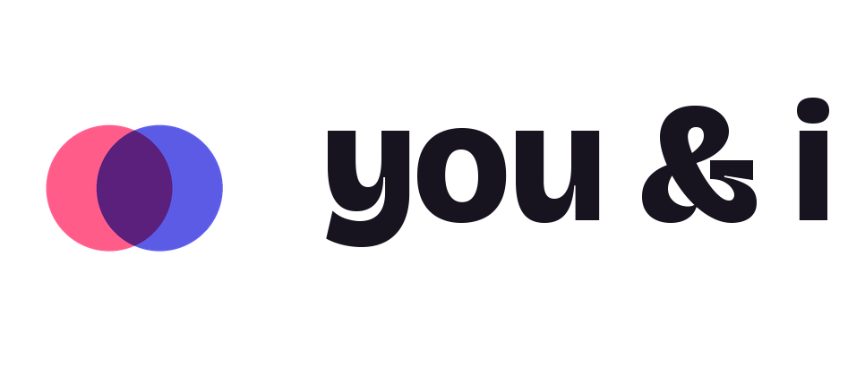
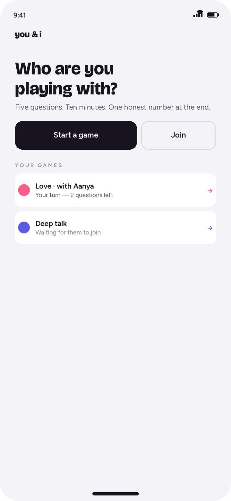
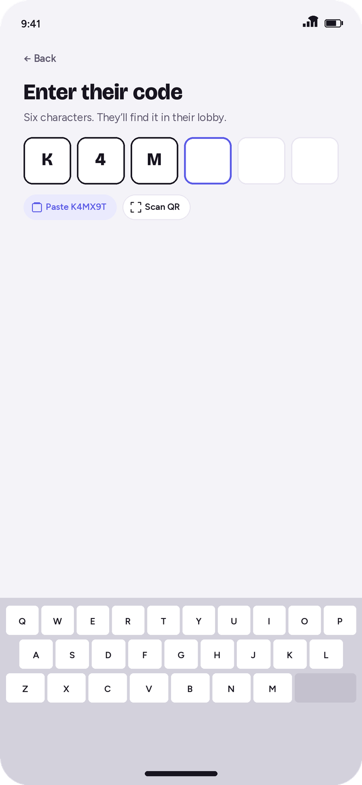
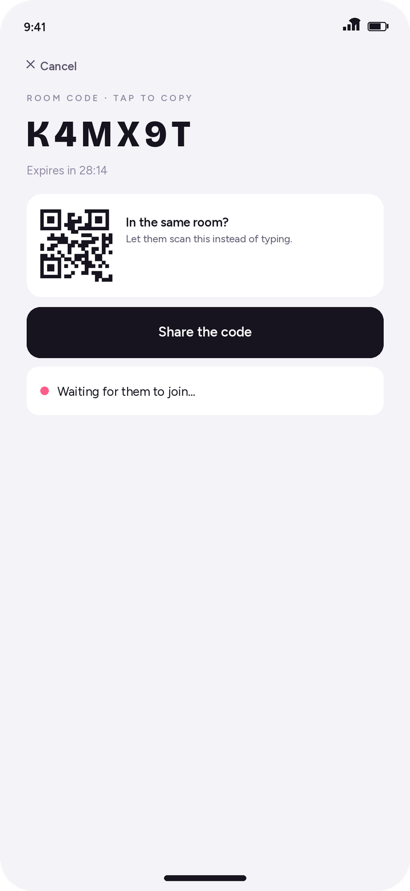
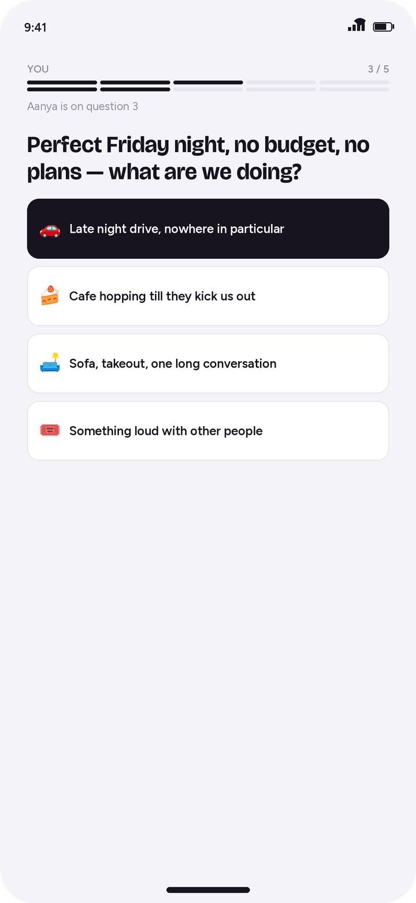
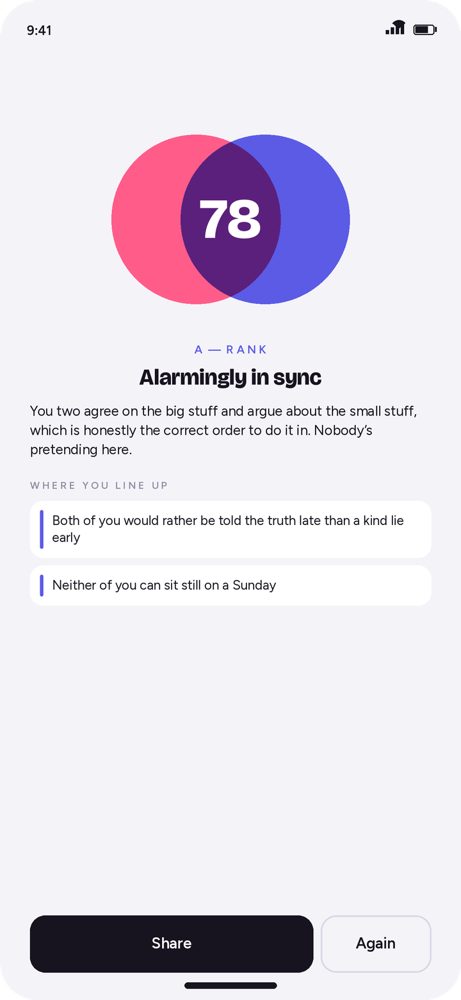
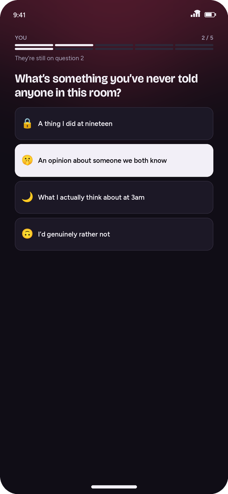
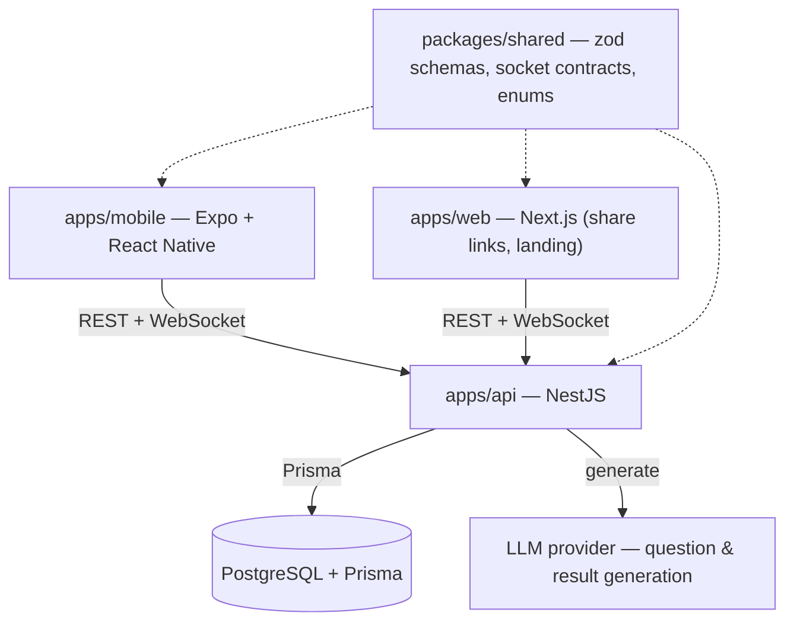
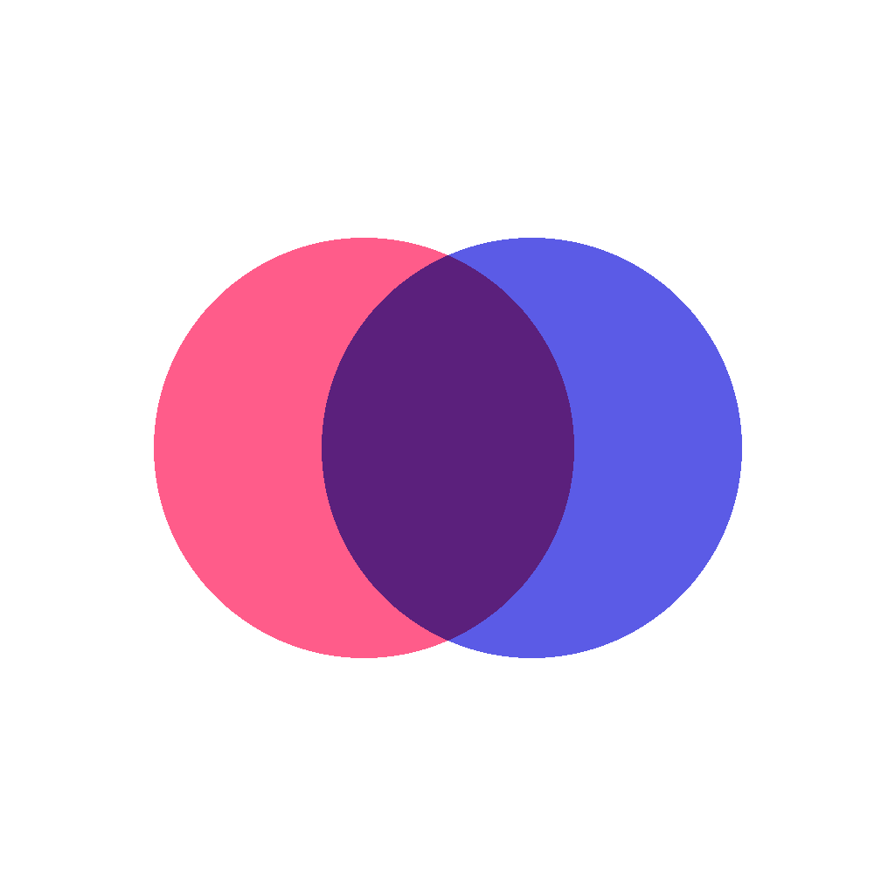

<div align="center">

<picture>
  <source media="(prefers-color-scheme: dark)" srcset=".github/readme/wordmark-dark.png">
  
</picture>

<br>

**A two-player compatibility game. Answer the same questions, find out how much you overlap.**

[](https://expo.dev)
[](https://reactnative.dev)
[](https://nestjs.com)
[](https://www.prisma.io)
[](https://socket.io)
[](https://www.typescriptlang.org)
[](#license)

</div>

---

**You & I** asks two people the same handful of questions — about love, friendship, deep talk, fun, or something spicier — and turns the answers into an honest compatibility score, a written read on where you align, and where you don't.

It started as a Next.js web app. It's now being rebuilt as a native app on **Expo**, with the same NestJS/PostgreSQL backend underneath. This repo is the monorepo for all of it.

> **A note on the screenshots below:** the mobile app is mid-migration. What you're seeing is the current design direction — real typography, real layout, real interaction states — rendered as mockups while the Expo build catches up. The [status](#project-status) section says exactly what's built versus what's next.

<br>

## Screenshots

<table>
<tr>
<td width="33%"></td>
<td width="33%"></td>
<td width="33%"></td>
</tr>
<tr>
<td align="center"><sub><b>Home</b> — pick up a game in progress or start a new one</sub></td>
<td align="center"><sub><b>Join</b> — paste or type a partner's room code</sub></td>
<td align="center"><sub><b>Lobby</b> — share the code, or let them scan it</sub></td>
</tr>
<tr>
<td width="33%"></td>
<td width="33%"></td>
<td width="33%"></td>
</tr>
<tr>
<td align="center"><sub><b>Quiz</b> — your progress and theirs, side by side</sub></td>
<td align="center"><sub><b>Results</b> — the score is how much your circles overlap</sub></td>
<td align="center"><sub><b>Spicy</b> — a different register gets a different theme</sub></td>
</tr>
</table>

## Features

- **Five categories** — love, friendship, deep talk, fun, and spicy, each generating its own question set
- **AI-generated questions**, with a hardcoded fallback set so a provider outage never blocks a game
- **Two ways to connect** — share a link, or read a room code out loud and have your partner type or scan it in
- **Live progress, private answers** — you can see that your partner answered, never what they picked, until the result is ready
- **Survives real mobile conditions** — backgrounding, dropped connections, and offline answer queues all resolve by re-syncing with the server, never by trusting a stale socket
- **A compatibility report**, not just a number — a score, a short written read, and the specific things you agree and disagree on
- **A shareable result card** for posting the score elsewhere

## Tech stack



The backend is the source of truth for everything. Sockets broadcast live hints — someone joined, someone answered, results are ready — but every client reconciles that against a REST call rather than trusting the socket event on its own. That one rule is why the app can survive a phone locking mid-quiz.

## Architecture at a glance

- **Server authoritative.** All game state — session, players, answers, results — lives in Postgres. The UI can act optimistically, but it always resolves against the server.
- **Shared contract package.** `packages/shared` holds every request/response schema and socket payload as Zod schemas, imported by both the API and every client. A shape change that isn't reflected everywhere fails at the type level, not at runtime on someone's phone.
- **Sockets are a hint layer, not state.** A dropped connection is not a lost game. Every client re-fetches from REST on reconnect or foreground rather than assuming it caught every event.
- **Room codes are claim tickets, not identities.** A session's real identity is a UUID. The six-character room code is nullable, unique, and only valid while a lobby is waiting — it's cleared the moment someone joins or it expires, which keeps the guessable code space small.
- **Native-safe storage only.** The mobile client never touches `localStorage`; player identity and session records live in `expo-secure-store`.

A fuller write-up of the schema, the API surface, and the socket event contract lives in [`docs/ARCHITECTURE.md`](docs/ARCHITECTURE.md).

## Monorepo structure

```text
apps/
  api/            NestJS backend — the authority for all game state
  mobile/         Expo app (React Native) — the primary client going forward
  web/            Next.js app — share-link landing page, legacy browser UI
packages/
  shared/         Zod schemas, TypeScript types, socket event contracts
```

## Getting started

### Prerequisites

- [Node.js](https://nodejs.org) 22 or later
- [pnpm](https://pnpm.io) (`npm install -g pnpm`)
- A PostgreSQL database (local, Docker, or hosted)
- An API key for your chosen LLM provider (Gemini or Groq)
- For the mobile app: [Expo Go](https://expo.dev/go) on your phone, or Android Studio / Xcode for a simulator

### Setup

```bash
git clone https://github.com/your-org/you-and-i.git
cd you-and-i
pnpm install

# copy and fill in environment files
cp apps/api/.env.example apps/api/.env
cp apps/mobile/.env.example apps/mobile/.env

# apply the database schema
pnpm --filter api db:migrate
```

### Run it

```bash
# backend — http://localhost:3000
pnpm --filter api dev

# web client — http://localhost:3001
pnpm --filter web dev

# mobile client — scan the QR with Expo Go
pnpm --filter mobile start
```

## Environment variables

<table>
<tr><th>Variable</th><th>Where</th><th>Purpose</th></tr>
<tr><td><code>DATABASE_URL</code></td><td>api</td><td>Postgres connection string</td></tr>
<tr><td><code>GEMINI_API_KEY</code> / <code>GROQ_API_KEY</code></td><td>api</td><td>LLM provider credentials — question and result generation</td></tr>
<tr><td><code>FRONTEND_URL</code></td><td>api</td><td>Allowed CORS origin(s), comma-separated</td></tr>
<tr><td><code>EXPO_PUBLIC_API_URL</code></td><td>mobile, web</td><td>Base URL of the API</td></tr>
<tr><td><code>EXPO_PUBLIC_WS_URL</code></td><td>mobile, web</td><td>WebSocket URL for the gateway</td></tr>
</table>

`EXPO_PUBLIC_*` values are compiled into the shipped app bundle and are readable by anyone — never put a secret behind that prefix.

## Scripts

<table>
<tr><th>Command</th><th>Runs</th></tr>
<tr><td><code>pnpm dev</code></td><td>All apps in parallel</td></tr>
<tr><td><code>pnpm build</code></td><td>Build every workspace</td></tr>
<tr><td><code>pnpm typecheck</code></td><td>TypeScript across the whole monorepo</td></tr>
<tr><td><code>pnpm lint</code></td><td>ESLint across the whole monorepo</td></tr>
<tr><td><code>pnpm --filter api db:migrate</code></td><td>Apply Prisma migrations</td></tr>
<tr><td><code>pnpm --filter api db:studio</code></td><td>Open Prisma Studio</td></tr>
<tr><td><code>pnpm --filter mobile start</code></td><td>Expo dev server</td></tr>
<tr><td><code>pnpm --filter mobile android</code></td><td>Open in an Android emulator</td></tr>
</table>

## Project status

| Area | Status |
|---|---|
| Web app (Next.js) | Shipped — share links, full game loop |
| Backend hardening for mobile | In progress — rehydration endpoint, async result generation, room codes |
| Expo app | In progress — design direction locked, screens in build |
| Room code join flow | Designed, not yet implemented |
| Pass-and-play (one device, two players) | Designed, not yet implemented |
| Play Store submission | Not started — pending closed testing |

## Contributing

Issues and PRs are welcome. Before opening a PR:

```bash
pnpm typecheck
pnpm lint
```

For mobile changes, also run `npx expo-doctor` inside `apps/mobile`.

## License

[MIT](LICENSE) — confirm this matches your actual license before publishing.

<br>

<div align="center">

<br>
<sub>you & i</sub>
</div>
