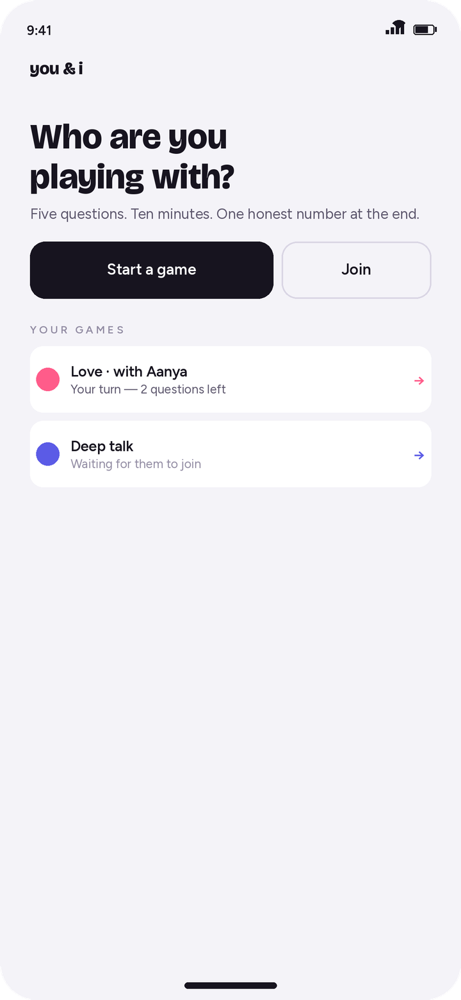
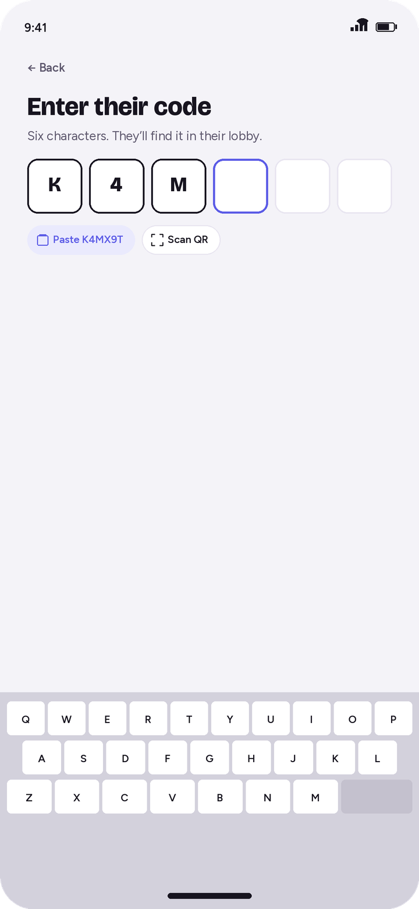
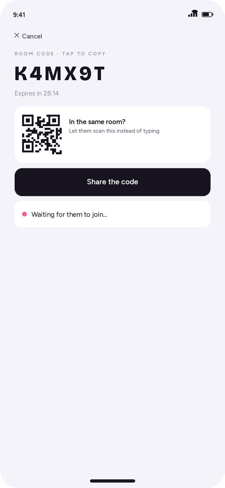
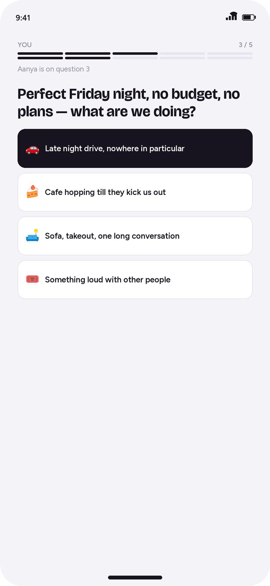
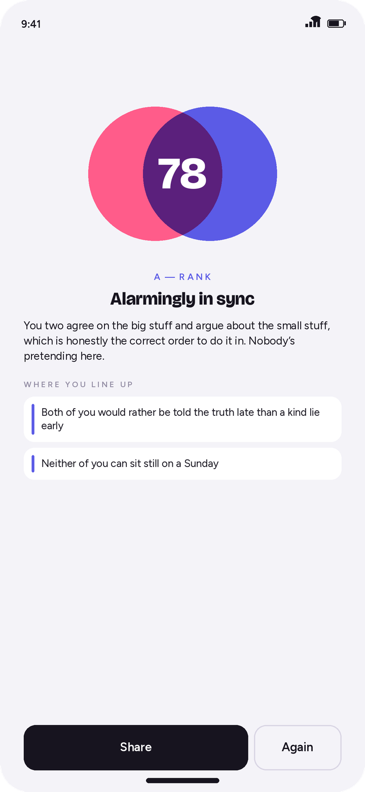
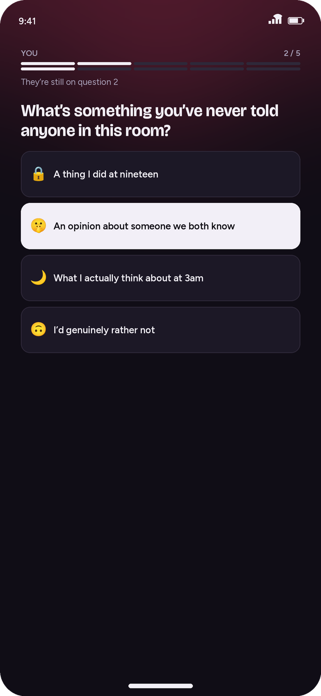
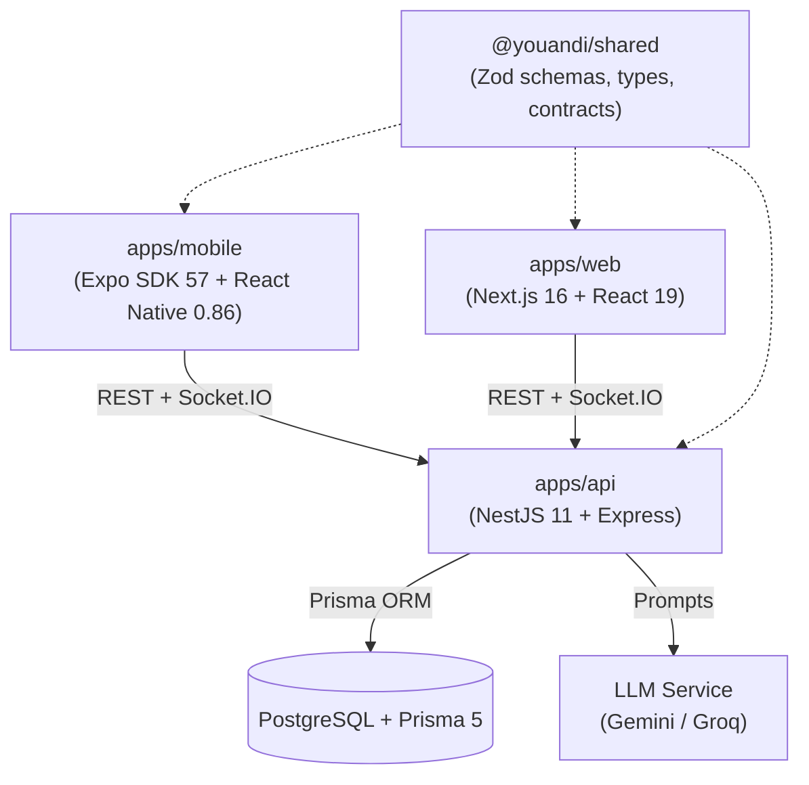

<div align="center">

<picture>
  <source media="(prefers-color-scheme: dark)" srcset=".github/readme/wordmark-dark.png">
  
</picture>

<br>

**A two-player compatibility game. Answer the same questions, find out how much you overlap.**

[](https://expo.dev)
[](https://reactnative.dev)
[](https://nestjs.com)
[](https://www.prisma.io)
[](https://socket.io)
[](https://www.typescriptlang.org)
[](#license)

</div>

---

**You & I** asks two people the same handful of questions — about love, friendship, deep talk, fun, or spicy — and turns their answers into an honest compatibility score, a written AI read on where they align, and where they diverge.

The project originated as a Next.js web application and has evolved into an **Expo (React Native)** native application powered by the same NestJS and PostgreSQL backend.

<br>

## Screenshots

<table>
<tr>
<td width="33%"></td>
<td width="33%"></td>
<td width="33%"></td>
</tr>
<tr>
<td align="center"><sub><b>Home</b> — pick up an active game or start a new one</sub></td>
<td align="center"><sub><b>Join</b> — enter or paste a 6-character room code</sub></td>
<td align="center"><sub><b>Lobby</b> — share the code, copy the link, or scan QR</sub></td>
</tr>
<tr>
<td width="33%"></td>
<td width="33%"></td>
<td width="33%"></td>
</tr>
<tr>
<td align="center"><sub><b>Quiz</b> — real-time progress pair for both players</sub></td>
<td align="center"><sub><b>Results</b> — interactive Venn overlap with score and summary</sub></td>
<td align="center"><sub><b>Spicy</b> — contextual dark palette for spicy quizzes</sub></td>
</tr>
</table>

## Features

- **Five core categories** — Love, Friendship, Deep Talk, Fun, and Spicy, each prompting distinct questions and custom themes.
- **AI question & result generation** — Powered by Google Gemini (default) or Groq, with resilient fallback generators if the LLM provider fails or times out.
- **Two connection modes** — Remote multiplayer via short 6-character room codes / deep links, or local **Pass & Play** on a single device.
- **Real-time synchronized progress** — Dual progress tracking via Socket.IO; answers remain private until both players finish and results are calculated.
- **Asynchronous result calculation** — The backend processes results in the background (`202 Accepted`) and delivers updates over WebSockets and REST polling.
- **Single-request rehydration** — Full `/session/:id/state` endpoint allows mobile and web clients to rehydrate state seamlessly after backgrounding, screen locks, or dropped connections.
- **Shareable result cards** — Exportable result graphics generated on-device with native share sheet integration (`react-native-view-shot` + `expo-sharing`).
- **Secure credential storage** — Bearer player IDs and device identity persist via `expo-secure-store` on native devices, preventing leaks in URLs or unencrypted local storage.
- **Active games dashboard** — Resume ongoing games or review completed sessions tracked by device identity (`GET /sessions/mine`).

## Tech stack


```mermaid
graph TD
    Mobile["apps/mobile<br/>(Expo SDK 57 + React Native 0.86)"]
    Web["apps/web<br/>(Next.js 16 + React 19)"]
    API["apps/api<br/>(NestJS 11 + Express)"]
    DB[("PostgreSQL + Prisma 5")]
    LLM["LLM Service<br/>(Gemini / Groq)"]
    Shared["@youandi/shared<br/>(Zod schemas, types, contracts)"]

    Mobile -- REST + Socket.IO --> API
    Web -- REST + Socket.IO --> API
    API -- Prisma ORM --> DB
    API -- Prompts --> LLM
    Shared -.-> Mobile
    Shared -.-> Web
    Shared -.-> API
```

## Architecture

- **Server-authoritative state:** PostgreSQL is the single source of truth for all sessions, players, questions, answers, and results. Clients never decide game state transitions locally.
- **Shared contract package (`@youandi/shared`):** Request/response bodies, route parameters, error codes, and Socket.IO payloads are defined as Zod schemas and shared across all apps.
- **Sockets as a hint layer:** Socket.IO events (`playerJoined`, `answerSubmitted`, `playerComplete`, `resultsReady`) signal clients to update or rehydrate. Clients re-fetch authoritative state over REST upon reconnecting or foregrounding.
- **Device & bearer identity:**
  - Authenticated endpoints validate `x-player-id` using NestJS `PlayerGuard`.
  - Client devices provide `x-device-id` to associate sessions and power the active games list (`GET /sessions/mine`).
- **Ephemeral room codes:** Six-character room codes act as temporary claim tickets with 30-minute expiration windows, rate-limited join protection, and periodic cleanup via scheduled cron tasks.

## Monorepo structure

```text
apps/
  api/            NestJS 11 backend, Prisma ORM, Socket.IO gateway, LLM service
  mobile/         Expo SDK 57 native mobile application (iOS & Android)
  web/            Next.js 16 web application (share links, browser player)
packages/
  shared/         Shared TypeScript types, Zod schemas, and WebSocket contracts
```

## Getting started

### Prerequisites

- [Node.js](https://nodejs.org) 22 or later
- [pnpm](https://pnpm.io) (`npm install -g pnpm`)
- PostgreSQL instance (local, Docker, or hosted)
- LLM API key ([Google AI Studio](https://aistudio.google.com/) for Gemini, or [Groq](https://groq.com/))
- For mobile development: [Expo Go](https://expo.dev/go) or Android Studio / Xcode simulators

### 1. Installation

```bash
git clone https://github.com/Parvsharma04/you-i.git
cd you-i
pnpm install
```

### 2. Environment configuration

Copy the example environment files:

```bash
cp apps/api/.env.example apps/api/.env
```

Create `apps/mobile/.env` (and optionally `apps/web/.env.local`):

```bash
# apps/mobile/.env
EXPO_PUBLIC_API_URL=http://localhost:8081
EXPO_PUBLIC_WS_URL=http://localhost:8081
EXPO_PUBLIC_WEB_URL=http://localhost:3000
```

> **Note for physical mobile devices running Expo Go:** Replace `localhost` in `apps/mobile/.env` with your host machine's LAN IP address (e.g. `http://192.168.1.X:8081`), as `localhost` inside a mobile device refers to the device itself.

### 3. Database migrations

```bash
pnpm db:migrate
```

### 4. Running the applications

Run all applications concurrently:

```bash
pnpm dev
```

Or run individual apps:

```bash
# Backend API — http://localhost:8081
pnpm --filter @youandi/api dev

# Web client — http://localhost:3000
pnpm --filter @youandi/web dev

# Mobile client — Expo dev server on port 8082
pnpm --filter @youandi/mobile start
```

## Environment variables

### `apps/api/.env`

| Variable | Required | Default | Description |
|---|---|---|---|
| `DATABASE_URL` | Yes | — | PostgreSQL connection string |
| `LLM_PROVIDER` | No | `gemini` | AI provider: `gemini` or `groq` |
| `GEMINI_API_KEY` | If provider is Gemini | — | Google Gemini API key |
| `GROQ_API_KEY` | If provider is Groq | — | Groq API key |
| `PORT` | No | `8081` | HTTP server port |
| `HOST` | No | `0.0.0.0` | Server network bind address |
| `ALLOWED_ORIGINS` | No | `http://localhost:3000` | Allowed browser origins for CORS (comma-separated) |
| `FRONTEND_URL` | No | `http://localhost:3000` | Fallback CORS origin if `ALLOWED_ORIGINS` is unset |
| `ALLOW_LEGACY_SESSION_ID_JOIN_BODY` | No | `true` | Permits legacy join body payloads during client upgrades |

### `apps/mobile/.env`

| Variable | Required | Default | Description |
|---|---|---|---|
| `EXPO_PUBLIC_API_URL` | No | `https://you-i.onrender.com` | Backend REST API base URL |
| `EXPO_PUBLIC_WS_URL` | No | Value of `EXPO_PUBLIC_API_URL` | Backend WebSocket / Socket.IO URL |
| `EXPO_PUBLIC_WEB_URL` | No | `https://you-i.onrender.com` | Base URL used to format invitation web links |

### `apps/web/.env.local`

| Variable | Required | Default | Description |
|---|---|---|---|
| `NEXT_PUBLIC_API_URL` | No | `http://localhost:8081` | Backend REST and Socket.IO gateway URL |

## Workspace scripts

| Command | Description |
|---|---|
| `pnpm dev` | Run all workspace apps in parallel |
| `pnpm build` | Build shared package and all apps |
| `pnpm typecheck` | Run `tsc --noEmit` across all workspaces |
| `pnpm lint` | Run ESLint across apps |
| `pnpm db:migrate` | Run Prisma database migrations (`@youandi/api`) |
| `pnpm --filter @youandi/api test` | Run backend Jest test suite |
| `pnpm --filter @youandi/mobile android` | Start Expo dev server targeted at Android emulator/device |
| `pnpm --filter @youandi/mobile ios` | Start Expo dev server targeted at iOS simulator |

## Project status

| Area / Feature | Status | Notes |
|---|---|---|
| Backend API & Sockets | ✅ Implemented | NestJS 11, Prisma 5, session state rehydration, background result generation, health metrics |
| AI Integration & Fallbacks | ✅ Implemented | Gemini & Groq providers with resilient fallback quiz and result generators |
| Ephemeral Room Codes | ✅ Implemented | 6-character normalized codes, join rate limits, and 5-minute automated expiration cron |
| Mobile Navigation & Screens | ✅ Implemented | Expo Router: Home, Create, Lobby, Join, Quiz, Results, and Pass & Play |
| Pass & Play (Local Multiplayer) | ✅ Implemented | Two-player turn-based flow on a single device with secure local storage |
| Deep Linking & QR Codes | ✅ Implemented | Universal links (`/j/[code]`, `/lobby/[sessionId]`) and in-app QR code generation |
| Mobile State Rehydration | ✅ Implemented | Seamless recovery after backgrounding, network switches, or force-quits |
| Result Sharing | ✅ Implemented | On-device PNG capture via `react-native-view-shot` and native share sheet via `expo-sharing` |
| Web Application | ✅ Implemented | Next.js browser client for game loops, active games list, and invitation redirects |
| Production App Store Release | 🚧 In progress | Google Play metadata and asset preparation in progress (`apps/mobile/STORE-ASSETS.md`) |

## Contributing

1. Verify TypeScript types:
   ```bash
   pnpm typecheck
   ```
2. Run backend tests:
   ```bash
   pnpm --filter @youandi/api test
   ```
3. For mobile modifications, verify dependencies with Expo:
   ```bash
   cd apps/mobile && npx expo-doctor
   ```

## License

This project is licensed under the [MIT License](apps/mobile/LICENSE).

<br>

<div align="center">

<br>
<sub>you & i</sub>
</div>
