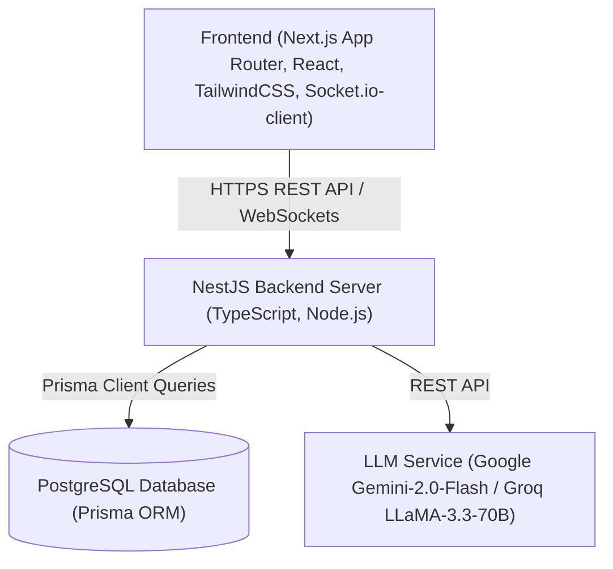
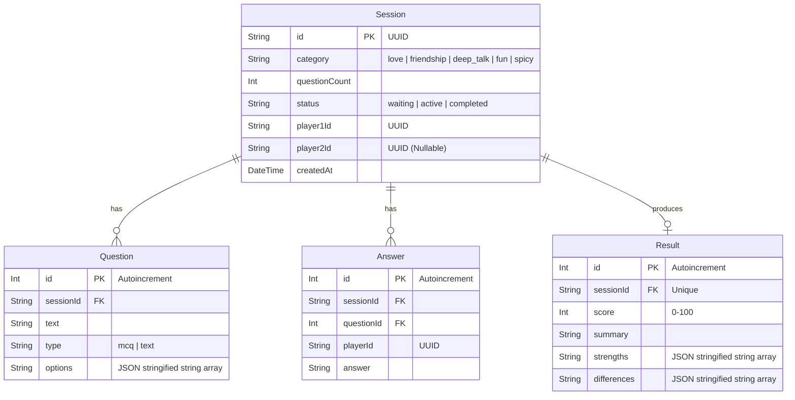
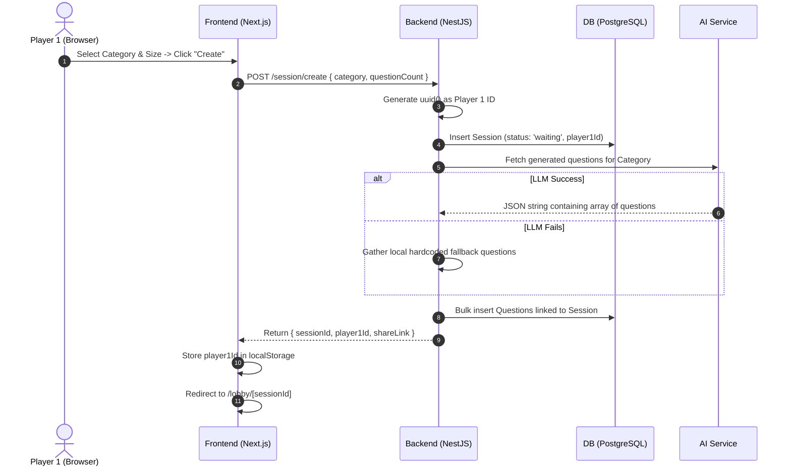
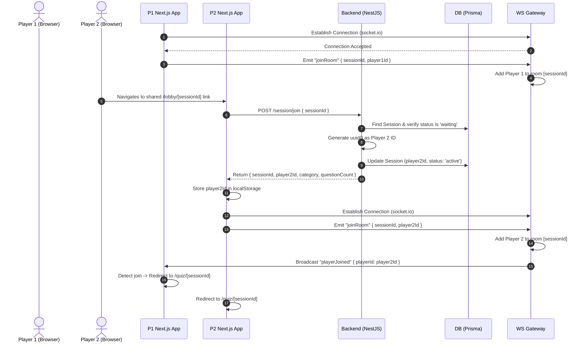
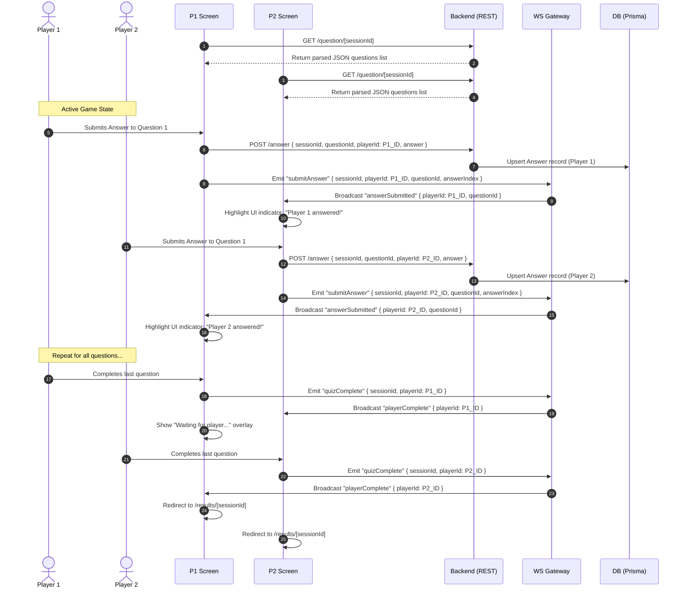
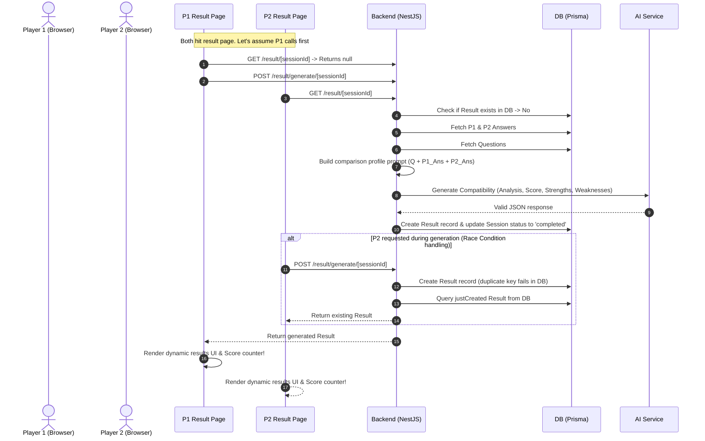

# You & I: System Architecture, Data Flow, and Connection Mechanics

This document provides a highly detailed, comprehensive guide to the architecture, data models, connection workflows, and end-to-end data lifecycles of the **You & I** (formerly *him&her*) compatibility application.

---

## 1. System Overview & Technology Stack

The application is designed as a real-time, interactive, two-player compatibility game. Players answer dynamic, AI-generated questions in a specific category (Love, Friendship, Deep Talk, Fun, or Spicy) and receive a deep, personalized relationship analysis.

### Stack Breakdown


- **Frontend**: Next.js (App Router, Client-side React Hooks, Custom CSS, and Socket.io-client for real-time signaling). It features standard-compliant, pixel-perfect layouts, responsive design, high-definition canvas sharing via `html-to-image`, and micro-animations.
- **Backend**: NestJS (TypeScript web framework) providing a structured, modular modular architecture (controllers, services, gateways, modules).
- **Database**: PostgreSQL accessed through Prisma ORM for type-safe queries.
- **AI Integrations**: A unified `LlmService` using a provider/factory pattern to switch between **Google Generative AI (Gemini 2.0 Flash)** and **Groq (LLaMA-3.3-70B)**.

---

## 2. Database Schema (Prisma Models)

The data layer is defined in `prisma/schema.prisma` and operates with four core tables: `Session`, `Question`, `Answer`, and `Result`.



### Table Structures

#### 1. `Session`
Stores metadata about a single game instance created by Player 1.
- `id` (`String`, Primary Key, UUID): The lobby's ID, which forms the joinable link.
- `category` (`String`): Category of questions. Supported categories:
  - `love` (romantic relationships)
  - `friendship` (platonic bonds)
  - `deep_talk` (existential/deep conversations)
  - `fun` (pop culture & lighthearted vibes)
  - `spicy` (bold, daring topics)
- `questionCount` (`Int`): Amount of questions requested (usually 5 to 10).
- `status` (`String`, default `"waiting"`): Status machine transitions: `waiting` (Player 1 waiting) $\rightarrow$ `active` (Player 2 joined, game on) $\rightarrow$ `completed` (Result generated).
- `player1Id` (`String`): Secret UUID generated for Player 1, stored locally in the player's browser.
- `player2Id` (`String?`, Nullable): Secret UUID generated for Player 2 when joining the session.
- `createdAt` (`DateTime`): Timestamp.

#### 2. `Question`
Stores individual questions generated dynamically by the LLM (or fallback logic) for a specific session.
- `id` (`Int`, Primary Key, Autoincrement)
- `sessionId` (`String`, Foreign Key): Associated session.
- `text` (`String`): Question wording.
- `type` (`String`, default `"mcq"`): Either `"mcq"` (multiple choice) or `"text"` (open-ended).
- `options` (`String?`): Stringified JSON array of MCQ options containing emojis (e.g., `["Late night drive 🚗", "Fancy cafe hopping 🍰", ...]`). Null for text questions.

#### 3. `Answer`
Stores responses submitted by each player.
- `id` (`Int`, Primary Key, Autoincrement)
- `sessionId` (`String`, Foreign Key)
- `questionId` (`Int`, Foreign Key)
- `playerId` (`String`): UUID of the submitting player (`player1Id` or `player2Id`).
- `answer` (`String`): Either the index of the selected MCQ option (as a string) or the raw text string for open-ended questions.
- **Unique Constraint**: `@@unique([sessionId, questionId, playerId])`. This guarantees that if a player re-submits an answer for a specific question, the system uses an SQL **Upsert** (update-if-exists, create-otherwise) instead of creating duplicates.

#### 4. `Result`
Stores the finalized AI-analyzed compatibility payload.
- `id` (`Int`, Primary Key, Autoincrement)
- `sessionId` (`String`, Unique Foreign Key): Linked session.
- `score` (`Int`): Compatibility score between 0 and 100.
- `summary` (`String`): Gen Z, playful, and deeply insightful narrative analysis.
- `strengths` (`String`): Stringified JSON array of mutual alignment areas.
- `differences` (`String`): Stringified JSON array of contrasts, growth areas, or cute differences.

---

## 3. Communication & Connection Flow (WebSockets & REST APIs)

To provide an immediate, reactive multiplayer experience without delays, the application uses **Dual-Mode Communication**:
1. **REST APIs (HTTP)**: For transactional operations (creating sessions, joining lobbies, submitting answers, generating reports).
2. **WebSockets (Socket.io)**: For real-time updates (triggering room joins, syncing typing status or submission markers, launching the quiz synchronously, broadcasting results).

### WebSocket Architecture
The NestJS server features a `QuizGateway` mounted on the main server. The frontend consumes this connection via the `useSocket` hook.

#### Gateway Events Map
| Event Name | Type | Initiated By | Payload | Purpose |
| :--- | :--- | :--- | :--- | :--- |
| `joinRoom` | Incoming | Client | `{ sessionId, playerId }` | Joins a Socket.io channel named after the `sessionId`. |
| `playerJoined` | Outgoing | Server (Broadcast) | `{ playerId }` | Sent to Player 1 when Player 2 successfully joins the lobby. |
| `submitAnswer` | Incoming | Client | `{ sessionId, playerId, questionId, answerIndex }` | Triggers whenever a player submits an answer. |
| `answerSubmitted`| Outgoing | Server (Broadcast) | `{ playerId, questionId, answerIndex }` | Relays to the other client so they see visual status indicators in real-time. |
| `quizComplete` | Incoming | Client | `{ sessionId, playerId }` | Signals that a player has completed all questions. |
| `playerComplete` | Outgoing | Server (Broadcast) | `{ playerId }` | Informs the other player that they are waiting in the end-lobby. |
| `resultsReady` | Outgoing | Server (Broadcast) | `QuizResult` payload | Emitted by the server to all room members once AI finishes generating reports. |

---

## 4. Step-by-Step E2E Data & Interaction Flow

The lifecycle of a single game session consists of four distinct phases:

### Phase A: Setup & Dynamic Question Generation


1. **Session Setup**: Player 1 selects a category (e.g. `love`) and question count (e.g. 5) on the home screen `/` and submits.
2. **API Call**: Frontend triggers `POST /session/create` mapping to `SessionController`.
3. **Database Insertion**: `SessionService` generates a secret UUID for `player1Id`, stores a new `Session` record in the database with status `"waiting"`.
4. **Dynamic Prompt Engineering**: The backend formats a structured prompt requesting exactly `count` questions. The instructions strictly mandate:
   - Modern, Gen Z, universal tone, playful but exploratory.
   - 4-choice Multiple Choice Questions (MCQs) decorated with expressive emojis.
   - 1-2 open-ended text questions for deeper storytelling.
   - Secure guardrails prohibiting offensive/harmful outputs.
   - Strict JSON-only array syntax response.
5. **AI Generation**: The `LlmService` queries the current provider. If Gemini fails due to rate limits or API key exhaustion, the code gracefully falls back to `getFallbackQuestions` to guarantee the game stays playable.
6. **Lobby Creation**: Generated questions are serialized and persisted in the `Question` table. The API responds with `{ sessionId, player1Id, questionIds, shareLink }`. The user is redirected to `/lobby/[sessionId]`.

---

### Phase B: Multiplayer Handshake & WS Connection


1. **Lobby Waiting**: Player 1's frontend starts a WebSocket connection via `useSocket` and emits `joinRoom` mapping to the `QuizGateway`.
2. **Player 2 Joins**: Player 2 accesses `/lobby/[sessionId]`. The client issues `POST /session/join` (`SessionController`).
3. **Database Handshake**: The backend validates that the lobby exists and has no player 2 yet. It generates a secret `player2Id` UUID, updates the database status of the session to `"active"`, and returns the join data.
4. **WebSocket Syncing**: Player 2's socket connects and joins the room.
5. **Simultaneous Transition**: The backend broadcasts the `playerJoined` event over the socket to Player 1. Upon intercepting the event, the frontend automatically updates both players' layouts and routes them to `/quiz/[sessionId]`.

---

### Phase C: Active Live Play (The Quiz)


1. **Fetch Questions**: Both players query `GET /question/[sessionId]` to get the dynamically generated questions list.
2. **Answer Persistence**: When a player selects an answer:
   - It performs an HTTP `POST /answer` to record their response safely in the `Answer` table using the Prisma `upsert` mechanism to prevent duplication if they change their minds.
   - It simultaneously emits a WebSocket `submitAnswer` event.
3. **Interactive Sync**: The socket gateway broadcasts `answerSubmitted` to the opponent. The opponent's client UI renders progress indicators (e.g., ticking checkbox indicators) in real-time, displaying live feedback without spoiling the option chosen.
4. **Completion**: Once a player completes all questions, they emit `quizComplete` and wait. When both players have completed the quiz, the frontend routes both of them to `/results/[sessionId]`.

---

### Phase D: AI Analysis Generation & Result Caching


1. **Double-Request Guard**: The frontend page `results/[sessionId]/page.tsx` starts loading. It first requests `GET /result/[sessionId]`.
   - If a result is already cached (e.g., Player 2 completes the quiz slightly slower and accesses the page after it has been created), it retrieves the cached result directly, saving API costs and database lookups.
   - If no result exists yet, the first client to load the page initiates a `POST /result/generate/[sessionId]`.
2. **Analysis Aggregation**: In `ResultService.generate`, the server reads both players' answers, joins them against the question texts, and constructs a structured payload.
3. **Advanced Relationship Diagnostics**: The LLM prompt acts as a relationship diagnostic:
   - Compares the answers side-by-side.
   - Computes a mathematical compatibility index (0-100).
   - Summarizes the vibes with descriptive, highly engaging Gen-Z syntax (2-3 sentences max).
   - Extracts exact alignment strengths (shared values/habits) and core differences (contrasts or growth areas).
   - Enforces strict security boundaries to prevent prompt injections.
4. **Race Condition Prevention**: The database features a `unique` constraint on `sessionId` for the `Result` table. If both browsers trigger `POST /result/generate` at the exact same millisecond, the database prevents duplication. The catching block catches the unique key error, queries the fast-written result, and safely routes it to the slower player with zero user disruption.
5. **Fallback Safety**: If the AI services are offline or experience a severe outage, the backend catches the error, generates a randomized fallback profile (50-90% compatibility with funny generic summaries), and saves it to guarantee the user's game always completes.
6. **Rendering & Sharing**:
   - The React screen animates a visual counter from 0 to the matching score and displays the dynamic results under S-RANK to F-RANK categories.
   - **Modern Sharing Card**: To allow users to share their matches on social media, the app features a hidden, optimized, beautiful 9:16 aspect ratio vertical graphic card. Clicking "SHARE IMAGE" triggers `toBlob()` on this card via `html-to-image` at a high-density `pixelRatio: 3`. It then launches the native mobile sharing interface using `navigator.share()` if available, or automatically downloads the file as a crisp PNG.

---

## 5. Summary of API Reference Endpoints

| Method | Endpoint | Description | Request Body / Params | Response Payload |
| :--- | :--- | :--- | :--- | :--- |
| **POST** | `/session/create` | Starts a new game session. | `{ category: string, questionCount: number }` | `{ sessionId: string, player1Id: string, questionIds: number[], shareLink: string }` |
| **POST** | `/session/join` | Joins an existing session as Player 2. | `{ sessionId: string }` | `{ sessionId: string, player2Id: string, category: string, questionCount: number }` |
| **GET** | `/session/:id` | Fetches details of a specific session. | `id: string` (param) | `Session` model JSON object |
| **GET** | `/question/:sessionId` | Gets all questions configured for the session. | `sessionId: string` (param) | `Array<{ id, text, type, options: string[], category }>` |
| **POST** | `/answer` | Submits/upserts an answer for a question. | `{ sessionId, questionId, playerId, answer }` | `Answer` model JSON object |
| **GET** | `/answer/:sessionId/count`| Tracks total completed answers count. | `sessionId: string` (param) | `{ player1: number, player2: number, totalExpected: number, bothComplete: boolean }` |
| **POST** | `/result/generate/:sessionId` | Triggers AI generation or returns cache. | `sessionId: string` (param) | `{ score, summary, strengths: string[], differences: string[] }` |
| **GET** | `/result/:sessionId` | Checks if a generated result exists. | `sessionId: string` (param) | `QuizResult` JSON object or `null` |

---

## 6. How the Connection Works (Step-by-Step Backend Connection Setup)

To verify connection pathways, the backend acts as a highly resilient NestJS server:
1. When NestJS boots up, the `AppModule` instantiates the `QuizGateway` mapping to the Socket.io WebSocket server, using custom CORS headers loaded directly from environment parameters:
   ```typescript
   @WebSocketGateway({
     cors: {
       origin: process.env.FRONTEND_URL ?? 'http://localhost:3000',
       credentials: true,
     },
   })
   ```
2. The client initiates a transport handshake utilizing either raw WebSockets or polling mode to maintain connection resilience regardless of proxy/firewall constraints:
   ```typescript
   const socket = io(SOCKET_URL, {
     transports: ['websocket', 'polling'],
   });
   ```
3. The server logs connection status logs on socket connection/disconnection.
4. When a player lands on `/lobby/[sessionId]`, the client triggers `joinRoom` emitting the session and player's identifiers. The socket client is successfully locked into a distinct, sandboxed Room `sessionId` inside the server's memory space via `client.join(data.sessionId)`.
5. Every subsequent state transition or live progress is scoped strictly to the room, preventing data leakage between unrelated concurrent players:
   ```typescript
   client.to(data.sessionId).emit('answerSubmitted', { ... });
   ```
